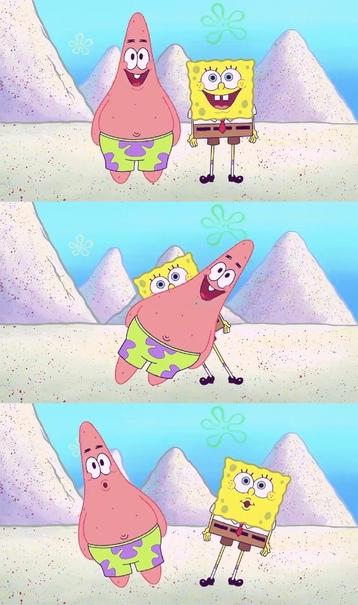

对比另外一个图片放大插件[vue-photo-preview](https://www.jianshu.com/p/5bc9f90d411c)，
 [photoswipe](https://photoswipe.com/)也是一款图片放大插件，使用之前需要知道PhotoSwipe需要预定义的图像尺寸。
可以控制多种风格：标题、分享、全屏按钮等，这里只需要放大，完整的查看[官网](https://photoswipe.com/)。
### 二者对比：
- photoswipe的功能更多，可以分享，全屏，但是photoswipe使用更复杂，需要引入的文件比较多，页面dome也过多，是通过href来实现图片放大。
- 相对于长图来说，vue-photo-preview的表现形式更好：
- 如果只适用于图片放大缩小我更倾向于vue-photo-preview；


### photoswipe使用：
- 首先引入需要使用的文件
```
 <link rel="stylesheet prefetch" href="dist/photoswipe.css">
 <link rel="stylesheet prefetch" href="dist/default-skin/default-skin.css">
 <script src="dist/photoswipeDl.js"></script>
 <script src="dist/photoswipe-ui-default.min.js"></script>
```
使用：如果有多个图片列表，要设置data-pswp-uid不同的值，顶层类名‘my-gallery’是固定的，图片父级href是图片地址，data-size是需要预定义的图像尺寸。
```
<div class="my-gallery clearfix picThree" data-pswp-uid="1">
    <figure class="box">
        <div class="img_dv">
            <div href="Allen.jpg" data-size="500x600">
                
            </div>
        </div>
    </figure>
    <figure class="box">
        <div class="img_dv">
            <div href="bg.png" data-size="500x600">
                
            </div>
        </div>
    </figure>
</div>
 <!--注意下面千万不要漏掉了：-->
<div class="pswp" tabindex="-1" role="dialog" aria-hidden="true">
    <div class="pswp__bg"></div>
    <div class="pswp__scroll-wrap">
        <div class="pswp__container">
            <div class="pswp__item"></div>
            <div class="pswp__item"></div>
            <div class="pswp__item"></div>
        </div>
        <div class="pswp__ui pswp__ui--hidden">
            <div class="pswp__top-bar">
                <div class="pswp__counter"></div>
               <!--一些可以操作的图标，这里我只需要放大和缩小，其他的按钮控件就拿掉了-->
                <button class="pswp__button pswp__button--close" title="Close (Esc)"></button>
                <button class="pswp__button pswp__button--fs" title="Toggle fullscreen"></button>
                <button class="pswp__button pswp__button--zoom" title="Zoom in/out"></button>
                <div class="pswp__preloader">
                    <div class="pswp__preloader__icn">
                        <div class="pswp__preloader__cut">
                            <div class="pswp__preloader__donut"></div>
                        </div>
                    </div>
                </div>
            </div>
            <div class="pswp__caption">
                <div class="pswp__caption__center"></div>
            </div>
        </div>
    </div>
</div>
```
- 前面说需要预定义尺寸，如果图片很多的话不可能自己一个赋值，这里用each给其赋值：
```
$(function () {
   $('img').each(function () {
     var w = $(this)[0].naturalWidth,
         h = $(this)[0].naturalHeight;
        $(this).attr('data-size', w + 'x' + h);
        $(this).parent().attr('data-size', w + 'x' + h);
    })
 });
```
- 初始化：
```
var initPhotoSwipeFromDOM = function(gallerySelector) {
        // 解析来自DOM元素幻灯片数据（URL，标题，大小...）
        var parseThumbnailElements = function(el) {
            if(!el) {
                return false;
            }
            var thumbElements = el.childNodes,
                numNodes = thumbElements.length,
                items = [],
                figureEl,
                linkEl,
                size,
                item,
                divEl;
            for(var i = 0; i < numNodes; i++) {
                figureEl = thumbElements[i]; // <figure> element
                // 仅包括元素节点
                if(figureEl.nodeType !== 1) {
                    continue;
                }
                divEl = figureEl.children[0];
                linkEl = divEl.children[0]; // <a> element
                size = linkEl.getAttribute('data-size').split('x');
                // 创建幻灯片对象
                item = {
                    src: linkEl.getAttribute('href'),
                    w: parseInt(size[0], 10),
                    h: parseInt(size[1], 10)
                };
                if(figureEl.children.length > 1) {
                    item.title = figureEl.children[1].innerHTML;
                }
                if(linkEl.children.length > 0) {
                    //  缩略图节点, 检索缩略图网址
                    item.msrc = linkEl.children[0].getAttribute('src');
                }
                item.el = figureEl; // 保存链接元素 for getThumbBoundsFn
                items.push(item);
            }
            return items;
        };

        // 查找最近的父节点
        var closest = function closest(el, fn) {
            return el && (fn(el) ? el : closest(el.parentNode, fn));
        };

        // 当用户点击缩略图触发
        var onThumbnailsClick = function(e) {
            e = e || window.event;
            e.preventDefault ? e.preventDefault() : e.returnValue = false;
            var eTarget = e.target || e.srcElement;
            var clickedListItem = closest(eTarget, function(el) {
                return(el.tagName && el.tagName.toUpperCase() === 'FIGURE');
            });
            if(!clickedListItem) {
                return;
            }
            var clickedGallery = clickedListItem.parentNode,
                childNodes = clickedListItem.parentNode.childNodes,
                numChildNodes = childNodes.length,
                nodeIndex = 0,
                index;
            for(var i = 0; i < numChildNodes; i++) {
                if(childNodes[i].nodeType !== 1) {
                    continue;
                }
                if(childNodes[i] === clickedListItem) {
                    index = nodeIndex;
                    break;
                }
                nodeIndex++;
            }
            if(index >= 0) {
                openPhotoSwipe(index, clickedGallery);
            }
            return false;
        };

        var photoswipeParseHash = function() {
            var hash = window.location.hash.substring(1),
                params = {};
            if(hash.length < 5) {
                return params;
            }
            var vars = hash.split('&');
            for(var i = 0; i < vars.length; i++) {
                if(!vars[i]) {
                    continue;
                }
                var pair = vars[i].split('=');
                if(pair.length < 2) {
                    continue;
                }
                params[pair[0]] = pair[1];
            }

            if(params.gid) {
                params.gid = parseInt(params.gid, 10);
                //修改之后的
                params = {};
                window.location.hash = ''
            }
            return params;
        };

        var openPhotoSwipe = function(index, galleryElement, disableAnimation, fromURL) {

            var pswpElement = document.querySelectorAll('.pswp')[0],
                gallery,
                options,
                items;
            items = parseThumbnailElements(galleryElement);
            // 这里可以定义参数
            options = {
                barsSize: {
                    top: 100,
                    bottom: 100
                },
                fullscreenEl: false,
                showHideOpacity: true,
                loop: false,
                galleryUID: galleryElement.getAttribute('data-pswp-uid'),
                getThumbBoundsFn: function(index) {
                    var thumbnail = items[index].el.getElementsByTagName('img')[0], // find thumbnail
                        pageYScroll = window.pageYOffset || document.documentElement.scrollTop,
                        rect = thumbnail.getBoundingClientRect();
                    return {
                        x: rect.left,
                        y: rect.top + pageYScroll,
                        w: rect.width
                    };
                }
            };
            if(fromURL) {
                if(options.galleryPIDs) {
                    for(var j = 0; j < items.length; j++) {
                        if(items[j].pid == index) {
                            options.index = j;
                            break;
                        }
                    }
                } else {
                    options.index = parseInt(index, 10) - 1;
                }
            } else {
                options.index = parseInt(index, 10);
            }
            if(isNaN(options.index)) {
                return;
            }
            if(disableAnimation) {
                options.showAnimationDuration = 0;
            }
            gallery = new PhotoSwipe(pswpElement, PhotoSwipeUI_Default, items, options);
            gallery.init();
        };
        var galleryElements = document.querySelectorAll(gallerySelector);
        for(var i = 0, l = galleryElements.length; i < l; i++) {
            galleryElements[i].setAttribute('data-pswp-uid', i + 1);
            galleryElements[i].onclick = onThumbnailsClick;
        }
        var hashData = photoswipeParseHash();
        //修改过后的 这里加了 &&window.location.hash
        if(hashData.pid && hashData.gid) {
            openPhotoSwipe(hashData.pid, galleryElements[hashData.gid - 1], true, true);
        }
    };
    initPhotoSwipeFromDOM('.my-gallery');
```
- 用在vue中时，由于图片是动态的，所以要在获得图片之后进行初始化，图片尺寸也在img的load事件里获得并赋值：
```
<!--html:-->
<div class="my-gallery clearfix picThree" data-pswp-uid="1">
    <figure class="box" v-for="(img_item,img_index) in imageList">
        <div class="img_dv">
             <div :href="img_item.url" data-size="500x600">
                 
            </div>
        </div>
    </figure>
</div>
<!--js:-->
updated: function() { //初始化photoswipe
   initPhotoSwipeFromDOM('.my-gallery');
},
 methods: {
   getImg: function(event) {
      var el = event.target;
      var w = $(el)[0].naturalWidth,
          h = $(el)[0].naturalHeight;
    $(el).attr('data-size', w + 'x' + h);
    $(el).parent().attr('data-size', w + 'x' + h);
  },
}
```

